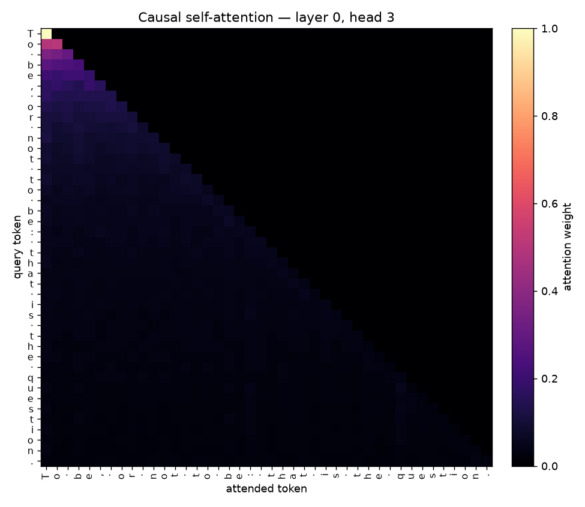
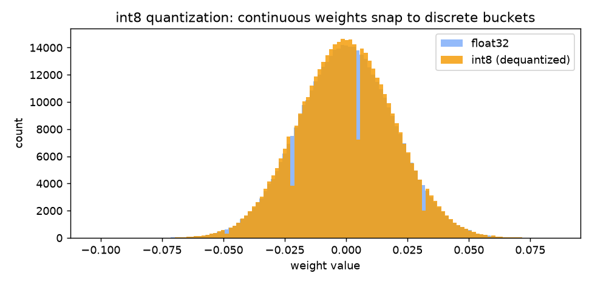
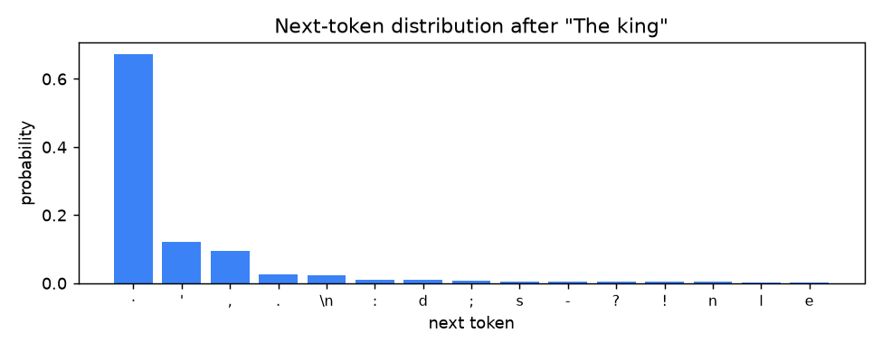

<div align="center">

# 🧠 PicoLM

**A GPT-style language model built from scratch in PyTorch.**

*From-scratch tokenizers (char + byte-pair BPE) · causal transformer · mixed-precision GPU training · KV-cache inference engine · int8 quantization — all with zero pretrained weights and zero LLM libraries.*


</div>

PicoLM is a from-scratch reimplementation of the GPT architecture. It is not a
wrapper around `transformers` and it loads no pretrained weights — the
tokenizer, the transformer, the training loop, and the inference engine are all
implemented from first principles. The goal is to make the entire
text → tokens → model → tokens → text pipeline transparent, so every line can
be read and understood.

> Part of a from-scratch ML systems series: [pico-kernels](https://github.com/Labeeb2339/pico-kernels) (Triton kernels) · [pico-diffusion](https://github.com/Labeeb2339/pico-diffusion) (a diffusion model) · [pico-engine](https://github.com/Labeeb2339/pico-engine) (a GGUF inference engine).

## ✨ What's inside

| Component | What it is |
|-----------|------------|
| **Tokenizers** | Char-level (ships with the demo model) + byte-level BPE (GPT-2 style), both from scratch |
| **Transformer** | Multi-head causal self-attention, GELU MLP, pre-norm residual blocks, weight tying — plus optional **RoPE** (rotary position embeddings) and **RMSNorm** (LLaMA-style) |
| **Training** | Mixed-precision (bfloat16) loop with AdamW, cosine LR + warmup, gradient clipping, gradient checkpointing, DDP, incremental metrics |
| **Inference** | KV-cache decoder that reuses past key/value states, plus top-k / top-p sampling |
| **Quantization** | Symmetric per-tensor int8 weight quantization (~4× smaller) |
| **Evaluation** | Perplexity vs unigram/bigram baselines, decode-speed + quantization benchmarks, zero-shot HellaSwag |

## 🚀 Quickstart

```bash
git clone https://github.com/Labeeb2339/picolm.git
cd picolm

# 1. Create a venv and install (CUDA 12.8 wheel for NVIDIA GPUs)
python -m venv .venv
source .venv/bin/activate          # Windows: .venv\Scripts\activate
pip install "torch>=2.5" --index-url https://download.pytorch.org/whl/cu128
pip install -e ".[demo]"

# 2. Train the reference configuration
python scripts/download_data.py
python -m picolm train --max-iters 2000 --eval-interval 250 --eval-iters 40 --batch-size 64 --seed 42

# 3. Generate
python -m picolm generate --ckpt out/ckpt.pt --prompt "To be, or not to be"

# 4. Evaluate (perplexity vs baselines) and benchmark (speed + quantization)
python -m picolm eval --ckpt out/ckpt.pt --text data/input.txt
python -m picolm benchmark --ckpt out/ckpt.pt --text data/input.txt

# 5. Play with it
picolm demo
```

## 🏗️ Architecture

```
                    ┌─────────────────────────────────────┐
                    │              input ids              │
                    │              (B, T)                 │
                    └───────────────┬─────────────────────┘
                                    │
                  token embedding   │   positional embedding
                        wte         │          wpe
                                    ▼
                    ┌───────────────────────────┐
                    │        (B, T, n_embd)      │
                    └───────────┬───────────────┘
                                │
                 ┌──────────────▼──────────────┐  × n_layer
                 │   LayerNorm                  │
                 │   CausalSelfAttention ──res──┤
                 │   LayerNorm                  │
                 │   MLP (GELU) ──────────res──┤
                 └──────────────┬──────────────┘
                                │
                    ┌───────────▼───────────┐
                    │        LayerNorm       │
                    │    lm_head (tied)      │
                    └───────────┬───────────┘
                                ▼
                          logits (B, T, V)
```

## 🖥️ Dashboard

`picolm demo` launches an interactive visualization dashboard with six lazy-loaded views:

On the prepared Windows machine, the one-command meeting launcher is
`powershell -ExecutionPolicy Bypass -File .\Start-Dashboard.ps1`. It binds to
`127.0.0.1` so the local checkpoint dashboard is not exposed to the network.

| View | What it shows |
|---|---|
| **Overview** | a meeting-friendly system map and three-minute walkthrough |
| **Generate** | interactive text generation with live sampling knobs |
| **Attention** | per-layer, per-head attention maps — the causal triangle, visible |
| **Sampling** | the next-token probability distribution reshaped by temperature/top-k/top-p |
| **Quantization** | float32 weights snapping onto int8 buckets, plus size + compression |
| **Training** | the loss curve and the cosine learning-rate schedule |

### What you'll see

**Causal self-attention** — each row is a query token; the lower-triangular
shape is the causal mask (a token can only attend to itself and the past):



**Quantization** — the smooth float32 weight distribution (blue) snaps onto
255 discrete int8 buckets (orange):



**Sampling** — the model's confidence over the very next token:



## 📊 Results

The demo model has **10,745,088 total trainable parameters** (10,646,784 when
learned positional embeddings are excluded, following the nanoGPT reporting
convention). It is trained on the [tiny Shakespeare]
corpus (1.1M characters) for 2,000 iterations on a single NVIDIA RTX 5070
Laptop GPU. Training uses dropout and early stopping: `ckpt.pt` is the
checkpoint with the lowest validation loss, not the last iteration.

**Best validation loss: 1.52** (cross-entropy, reached at step 1,250)


**Perplexity vs baselines** (held-out, 111,540 tokens):

| Model | Perplexity |
|---|---|
| Unigram baseline | 28.43 |
| Bigram baseline | 11.96 |
| **PicoLM** | **4.59** (2.61× better than bigram) |

**Quantization** (symmetric per-tensor int8): 3.99× smaller (42.98 → 10.76 MB,
including the fp32 normalization vectors) with
perplexity change −0.023% on the exact same seeded validation windows.

**Decode speed**: KV caching avoids recomputing earlier keys and values. Earlier
synchronized 200-token runs ranged from parity to 1.54×; the clean
`148a0d2` receipt measured **1.61×** (308.3 eager vs 495.9 cached tokens/s).
The spread is why this remains a mechanism demo, not a throughput guarantee.

**Zero-shot HellaSwag** (commonsense multiple-choice, chance = 25%): **25.0%**
(499/2000). The result is consistent with chance — HellaSwag measures general
English commonsense, which requires web-scale pretraining; the demo model is
trained on 1.1 MB of Shakespeare with a 65-character vocabulary, so it scores at
chance. The harness (`picolm/hellaswag.py`) is correct and ready to run on a
larger general-English model.

📄 **Full methodology, limitations, and reproducibility: [MODEL_CARD.md](MODEL_CARD.md)**

🔎 **Exact artifact hashes, environment, commands, and verification receipts:
[REPRODUCIBILITY.md](REPRODUCIBILITY.md)**

🧾 **Clean RTX 5070 run:** [receipt and checksummed logs](out/evidence/20260822-235049/)

**Sample output** (temperature 0.8, top-k 40):

```
To be, or not to bed,
His affects of the time modeheal of your consul.

KING EDWARD IV:
O Clery we speak! what we we that you depeny?

PETER:
Well, good I shall get us to be a king.

KING EDWARD IV:
The wanting upon it
```

> The model is intentionally small so it trains in minutes on a laptop GPU.
> It produces readable, Shakespeare-flavoured text — the architecture is what
> scales to GPT-2/3, not the parameter count.

## 🔬 How it works

**Tokenizer.** [`picolm/tokenizer.py`](src/picolm/tokenizer.py) implements two
tokenizers from scratch. `CharTokenizer` maps every unique character to an id —
the demo model trains on tiny Shakespeare with a 65-character vocabulary. A
byte-level `BPETokenizer` is also included: its base vocabulary is the 256 raw
bytes, training repeatedly fuses the most frequent adjacent byte pair until the
target size is reached, and encoding applies the learned merges greedily (pass
`--tokenizer bpe` to train with it). Decoding is lossless in both.

**Model.** [`picolm/model.py`](src/picolm/model.py) is a decoder-only
transformer: token + positional embeddings, a stack of pre-norm blocks
(LayerNorm → causal multi-head attention → residual → LayerNorm → GELU MLP →
residual), and a final LayerNorm + weight-tied LM head. The causal mask is
registered as a buffer so no per-step allocation happens.

**Training.** [`picolm/training.py`](src/picolm/training.py) uses automatic
mixed precision (bfloat16) with a `GradScaler`, AdamW with weight decay applied
only to matrix parameters, a cosine learning-rate schedule with warmup, gradient
clipping, and dropout regularization. Because tiny Shakespeare is small and
low-entropy, the model can memorize it — so training also performs
**early stopping**: the checkpoint saved as `ckpt.pt` is always the one with
the lowest validation loss, not the last iteration.

Three production levers are opt-in:

- **Gradient checkpointing** (`--grad-checkpoint` / `grad_checkpoint=True`) —
  recomputes block activations in the backward pass: measured **4210 MB → 1206 MB
  (3.5× less activation memory) at ~1.33× the step time** on a 12-layer / 768-dim
  config. The standard memory-for-compute tradeoff.
- **Distributed data parallel** — launch with `torchrun --nproc_per_node=N`;
  `LOCAL_RANK` triggers the DDP path (rank-0-only saves/logging, per-rank seed).
  Validated on Linux/NCCL only: Windows torch wheels ship without NCCL and their
  gloo backend is unstable.
- **Incremental metrics** — every eval step appends one line to
  `metrics.jsonl` (step, train/val loss, lr, elapsed), so a crash never loses
  the loss curve; the full summary still lands in `metrics.json`.

**Inference.** [`picolm/inference.py`](src/picolm/inference.py) adds the
"serving" half: a KV-cache decoder that hand-unrolls the default transformer
from the raw weights (so attention never recomputes over the full sequence),
top-k / top-p sampling, and symmetric per-tensor int8 quantization that stores
each selected matrix as `round(w / scale)` plus a single scale. KV/eager parity
is tested while prompt plus generation fits inside the learned context window;
unsupported RoPE/RMSNorm cache use and overlength requests fail explicitly.
The int8 experiment dequantizes weights for PyTorch evaluation; it is not an
int8 matrix-multiplication kernel.

## 🗂️ Project structure

```
picolm/
├── src/picolm/
│   ├── tokenizer.py     # char + byte-level BPE tokenizers
│   ├── model.py         # GPT transformer (attention, MLP, blocks)
│   ├── training.py      # mixed-precision training loop + early stopping
│   ├── inference.py     # KV-cache, sampling, int8 quantization
│   ├── eval.py          # perplexity + unigram/bigram baselines
│   ├── hellaswag.py     # zero-shot HellaSwag (commonsense) eval
│   ├── benchmark.py     # decode-speed + quantization benchmarks
│   ├── cli.py           # command-line interface
│   └── demo.py          # Streamlit demo
├── MODEL_CARD.md        # full methodology, results, limitations
├── REPRODUCIBILITY.md   # hashes, exact commands, evidence boundaries
├── reproducibility/     # artifact manifest + environment snapshot
├── scripts/             # no-install entry points + plotting
├── tests/               # CPU tests plus GPU-gated Triton parity tests
└── .github/workflows/   # CI
```

## ✅ Testing

```bash
pip install -e ".[dev]"
pytest          # tokenizers, causality, in-context KV/eager parity, baselines,
                # quantization, attention maps, RoPE/RMSNorm, and HellaSwag
```

## 📄 Attribution

Copyright © 2026 Muhammad Labeeb Aryan Bin Mohd Lokman. No repository license
has been selected yet; add one only after the owner makes that legal choice.
The training corpus is
[tiny Shakespeare], collected by Andrej Karpathy. Architecture follows the
GPT-2 paper ([Radford et al., 2019](https://d4mucfpksywv.cloudfront.net/better-language-models/language-models-are-unsupervised-multitask-learners.pdf)).

[tiny Shakespeare]: https://raw.githubusercontent.com/karpathy/char-rnn/master/data/tinyshakespeare/input.txt
