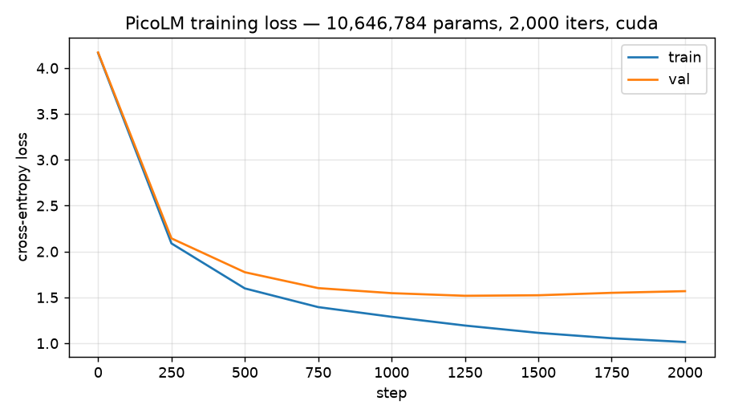

<div align="center">

# 🧠 PicoLM

**A GPT-style language model built from scratch in PyTorch.**

*Hand-written byte-pair-encoding tokenizer · causal transformer · mixed-precision GPU training · KV-cache inference engine · int8 quantization — all with zero pretrained weights and zero LLM libraries.*


</div>

PicoLM is a from-scratch reimplementation of the GPT architecture. It is not a
wrapper around `transformers` and it loads no pretrained weights — the
tokenizer, the transformer, the training loop, and the inference engine are all
implemented from first principles. The goal is to make the entire
text → tokens → model → tokens → text pipeline transparent, so every line can
be read and understood.

## ✨ What's inside

| Component | What it is |
|-----------|------------|
| **BPE tokenizer** | Byte-pair encoding trained on raw UTF-8 bytes (GPT-2 style), implemented from scratch |
| **Transformer** | Multi-head causal self-attention, GELU MLP, pre-norm residual blocks, weight tying |
| **Training** | Mixed-precision (bfloat16) loop with AdamW, cosine LR + warmup, gradient clipping, checkpointing |
| **Inference** | KV-cache decoder that reuses past key/value states, plus top-k / top-p sampling |
| **Quantization** | Symmetric per-tensor int8 weight quantization (~4× smaller) |

## 🚀 Quickstart

```bash
git clone https://github.com/Labeeb2339/picolm.git
cd picolm

# 1. Create a venv and install (CUDA 12.8 wheel for NVIDIA GPUs)
python -m venv .venv
source .venv/bin/activate          # Windows: .venv\Scripts\activate
pip install torch --index-url https://download.pytorch.org/whl/cu128
pip install -e ".[demo]"

# 2. Train (downloads tiny Shakespeare automatically on first run)
python scripts/download_data.py
python -m picolm train --max-iters 6000

# 3. Generate
python -m picolm generate --ckpt out/ckpt.pt --prompt "To be, or not to be"

# 4. Play with it
picolm demo
```

## 🏗️ Architecture

```
                    ┌─────────────────────────────────────┐
                    │              input ids              │
                    │              (B, T)                 │
                    └───────────────┬─────────────────────┘
                                    │
                  token embedding   │   positional embedding
                        wte         │          wpe
                                    ▼
                    ┌───────────────────────────┐
                    │        (B, T, n_embd)      │
                    └───────────┬───────────────┘
                                │
                 ┌──────────────▼──────────────┐  × n_layer
                 │   LayerNorm                  │
                 │   CausalSelfAttention ──res──┤
                 │   LayerNorm                  │
                 │   MLP (GELU) ──────────res──┤
                 └──────────────┬──────────────┘
                                │
                    ┌───────────▼───────────┐
                    │        LayerNorm       │
                    │    lm_head (tied)      │
                    └───────────┬───────────┘
                                ▼
                          logits (B, T, V)
```

## 📊 Results

The demo model (~10.6M parameters) is trained on the [tiny Shakespeare]
corpus (1.1M characters) for 2,000 iterations on a single NVIDIA RTX 5070
Laptop GPU. Training uses dropout and early stopping: `ckpt.pt` is the
checkpoint with the lowest validation loss, not the last iteration.

**Best validation loss: 1.52** (cross-entropy, reached at step 1,250)



**Sample output** (temperature 0.8, top-k 40):

```
To be, or not to bed,
His affects of the time modeheal of your consul.

KING EDWARD IV:
O Clery we speak! what we we that you depeny?

PETER:
Well, good I shall get us to be a king.

KING EDWARD IV:
The wanting upon it
```

> The model is intentionally small so it trains in minutes on a laptop GPU.
> It produces readable, Shakespeare-flavoured text — the architecture is what
> scales to GPT-2/3, not the parameter count.

## 🔬 How it works

**Tokenizer.** [`picolm/tokenizer.py`](src/picolm/tokenizer.py) implements a
byte-level BPE tokenizer. The base vocabulary is the 256 raw bytes; training
repeatedly fuses the most frequent adjacent byte pair until the target
vocabulary size is reached. Encoding applies the learned merges greedily, and
decoding is lossless by construction.

**Model.** [`picolm/model.py`](src/picolm/model.py) is a decoder-only
transformer: token + positional embeddings, a stack of pre-norm blocks
(LayerNorm → causal multi-head attention → residual → LayerNorm → GELU MLP →
residual), and a final LayerNorm + weight-tied LM head. The causal mask is
registered as a buffer so no per-step allocation happens.

**Training.** [`picolm/training.py`](src/picolm/training.py) uses automatic
mixed precision (bfloat16) with a `GradScaler`, AdamW with weight decay applied
only to matrix parameters, a cosine learning-rate schedule with warmup, gradient
clipping, and dropout regularization. Because tiny Shakespeare is small and
low-entropy, the model can memorize it — so training also performs
**early stopping**: the checkpoint saved as `ckpt.pt` is always the one with
the lowest validation loss, not the last iteration.

**Inference.** [`picolm/inference.py`](src/picolm/inference.py) adds the
"serving" half: a KV-cache decoder that hand-unrolls the transformer from the
raw weights (so attention never recomputes over the full sequence), top-k /
top-p sampling, and symmetric per-tensor int8 quantization that stores each
weight matrix as `round(w / scale)` plus a single scale.

## 🗂️ Project structure

```
picolm/
├── src/picolm/
│   ├── tokenizer.py     # char + byte-level BPE tokenizers
│   ├── model.py         # GPT transformer (attention, MLP, blocks)
│   ├── training.py      # mixed-precision training loop
│   ├── inference.py     # KV-cache, sampling, int8 quantization
│   ├── cli.py           # command-line interface
│   └── demo.py          # Streamlit demo
├── scripts/             # no-install entry points + plotting
├── tests/               # pytest suite (15 tests)
└── .github/workflows/   # CI
```

## ✅ Testing

```bash
pip install -e ".[dev]"
pytest          # 15 tests: tokenizer round-trips, causality, KV-cache == eager, quantization
```

## 📄 License & attribution

MIT © 2026 Muhammad Labeeb Aryan Bin Mohd Lokman. Training corpus is
[tiny Shakespeare], collected by Andrej Karpathy. Architecture follows the
GPT-2 paper ([Radford et al., 2019](https://d4mucfpksywv.cloudfront.net/better-language-models/language-models-are-unsupervised-multitask-learners.pdf)).

[tiny Shakespeare]: https://raw.githubusercontent.com/karpathy/char-rnn/master/data/tinyshakespeare/input.txt
